# Architectural Specification: CurvePT (3D Curve Perception Transformer)

**CurvePT** is an end-to-end, multi-modal transformer architecture engineered for 3D Deformable Linear Object (DLO) detection, continuous spatial tracking, and topological reconstruction (e.g., industrial wire harnesses, surgical threads, robotic cabling). Rather than relying on coarse 3D bounding boxes or unconstrained discrete point sets, CurvePT formulates DLO detection as a **direct parametric curve regression problem** using **learnable curve queries**, **differentiable clamped cubic B-spline modeling**, and **iterative spatial refinement**.

---

## 1. Publication-Ready Architecture Diagram

```mermaid
flowchart TD
    %% Global Styling
    classDef inputStyle fill:#EBF3FB,stroke:#2B6CB0,stroke-width:2px,color:#1A365D,rx:8,ry:8
    classDef rgbStyle fill:#EBF8FF,stroke:#3182CE,stroke-width:2px,color:#2B6CB0,rx:8,ry:8
    classDef geoStyle fill:#E6FFFA,stroke:#319795,stroke-width:2px,color:#234E52,rx:8,ry:8
    classDef fusionStyle fill:#FAF5FF,stroke:#805AD5,stroke-width:2px,color:#44337A,rx:8,ry:8
    classDef decoderStyle fill:#FFF5F5,stroke:#E53E3E,stroke-width:2px,color:#742A2A,rx:8,ry:8
    classDef headStyle fill:#FFFAF0,stroke:#DD6B20,stroke-width:2px,color:#7B341E,rx:8,ry:8
    classDef outStyle fill:#F0FFF4,stroke:#38A169,stroke-width:2px,color:#22543D,rx:8,ry:8
    classDef bsplineStyle fill:#FEFCBF,stroke:#D69E2E,stroke-width:2px,color:#744210,rx:8,ry:8

    %% -------------------------------------------------------------
    %% INPUT SUBGRAPH
    %% -------------------------------------------------------------
    subgraph Inputs ["1. Multi-Modal Sensor Inputs"]
        RGB_In["RGB Image (3 x H x W)<br/>1280 x 720 px (ImageNet Norm)"]:::inputStyle
        Depth_In["Metric Depth Map (1 x H x W)<br/>1280 x 720 px (Meters)"]:::inputStyle
        Norm_In["Surface Normals (3 x H x W)<br/>1280 x 720 px (Unit Vectors)"]:::inputStyle
    end

    %% -------------------------------------------------------------
    %% DUAL STREAM BACKBONE
    %% -------------------------------------------------------------
    subgraph Encoders ["2. Asymmetric Dual-Stream Encoders"]
        subgraph RGB_Branch ["RGB Visual Stream"]
            DINO["DINOv2 ViT-B/14 (Frozen 86M Params)<br/>Patch Size: 14 x 14 | 12 Blocks"]:::rgbStyle
            LoRA["Injected LoRA Adapters (r=16, &alpha;=32)<br/>Adapted on Last 6 ViT Blocks"]:::rgbStyle
            RGB_Tokens["RGB Token Grid: (B, 4784, 768)<br/>Grid Size: 52 x 92 (h_t x w_t)"]:::rgbStyle
            DINO --> LoRA --> RGB_Tokens
        end

        subgraph Geo_Branch ["Geometry Stream"]
            GeoConcat["Channel Concat: (B, 4, H, W)<br/>[Depth (1) + Normals (3)]"]:::geoStyle
            Stem1["Conv2d 7x7 (s=2, c=128) + GN + GELU"]:::geoStyle
            Stem2["Conv2d 7x7 (s=7, c=256) + GN + GELU<br/>Total Stride = 14x"]:::geoStyle
            PosGeo["Learnable 2D Position Embedding<br/>(1, 256, 52, 92)"]:::geoStyle
            ConvNeXt4["4x ConvNeXt Blocks (dim=256)<br/>7x7 DW-Conv + LN + Pointwise FFN"]:::geoStyle
            Geo_Tokens["Geo Token Grid: (B, 4784, 256)"]:::geoStyle

            GeoConcat --> Stem1 --> Stem2 --> PosGeo --> ConvNeXt4 --> Geo_Tokens
        end
    end

    %% -------------------------------------------------------------
    %% CROSS-MODAL FUSION
    %% -------------------------------------------------------------
    subgraph FusionModule ["3. High-Performance Spatial Cross-Modal Fusion"]
        Unflatten["Reshape Tokens to 2D Spatial Grids<br/>RGB: (B, 768, 52, 92) | Geo: (B, 256, 52, 92)"]:::fusionStyle
        Geo1x1["1x1 Conv Projection: 256 &rarr; 768 dims"]:::fusionStyle
        Concat2D["Spatial Channel Concatenation<br/>(B, 1536, 52, 92)"]:::fusionStyle
        FuseConv["1x1 Conv: 1536 &rarr; 768 + GELU"]:::fusionStyle
        DW_Block["7x7 Depthwise Conv (groups=768)<br/>+ GroupNorm + Dropout2d + 1x1 Conv"]:::fusionStyle
        ResidualFuse["Residual Skip Connection<br/>F_fused = F_rgb + ConvBlock(F_cat)"]:::fusionStyle
        SceneMemory["Flatten to Scene Memory Tokens<br/>S &isin; R^(B x 4784 x 768)"]:::fusionStyle

        Unflatten --> Geo1x1 --> Concat2D --> FuseConv --> DW_Block --> ResidualFuse --> SceneMemory
        Unflatten -.->|Residual Identity| ResidualFuse
    end

    %% -------------------------------------------------------------
    %% QUERY DECODER
    %% -------------------------------------------------------------
    subgraph DecoderModule ["4. Iterative Curve Query Decoder (6 Layers)"]
        QueryEmbed["Q=20 Learnable Curve Queries<br/>E_Q &isin; R^(20 x 768)"]:::decoderStyle

        subgraph DecLayer ["Decoder Layer l &isin; {0, 1, ..., 5}"]
            SelfAttn["Multi-Head Self-Attention (12 Heads)<br/>Inter-DLO Relational Reasoning & Bundle Disentanglement"]:::decoderStyle
            CrossAttn["Multi-Head Cross-Attention (12 Heads)<br/>Query-to-Scene Grounding (4784 Tokens)"]:::decoderStyle
            DecFFN["Pointwise FFN: 768 &rarr; 2048 &rarr; 768 (GELU)"]:::decoderStyle
            SelfAttn --> CrossAttn --> DecFFN
        end

        QueryEmbed --> DecLayer
        SceneMemory -.->|Key / Value| CrossAttn
    end

    %% -------------------------------------------------------------
    %% PREDICTION HEADS & B-SPLINE RECONSTRUCTION
    %% -------------------------------------------------------------
    subgraph HeadsModule ["5. Decoupled Prediction Heads & B-Spline Geometry Engine"]
        subgraph CoordBranch ["Coordinate Branch (Decoupled per Layer)"]
            CoordMLP["Layer-Specific 3-Layer MLP<br/>Layer 0: Macro Proposals | Layers 1-5: Residual Deltas"]:::headStyle
            CtrlPts["Predicted 3D Control Points<br/>C &isin; R^(B x Q x 12 x 3)"]:::headStyle
            BasisMatrix["Precomputed Clamped Cubic B-Spline Basis<br/>B &isin; R^(64 x 12) (Fixed Buffer, C^2 Continuous)"]:::bsplineStyle
            MatMul["Differentiable Basis Evaluation<br/>P = B &times; C &isin; R^(B x Q x 64 x 3)"]:::bsplineStyle
            ResidualAdd["Delta Addition (Layers 1-5)<br/>P^(l) = P^(l-1) + &Delta;P^(l)"]:::headStyle

            CoordMLP --> CtrlPts
            CtrlPts --> MatMul
            BasisMatrix --> MatMul
            MatMul --> ResidualAdd
        end

        subgraph AuxHeads ["Auxiliary Heads (Shared Weights Across Layers)"]
            VisMLP["Visibility Head (2-Layer MLP)<br/>768 &rarr; 128 &rarr; 64 nodes (Sigmoid)"]:::headStyle
            ConfMLP["Confidence Head (2-Layer MLP)<br/>768 &rarr; 128 &rarr; 1 logit (Focal Target)"]:::headStyle
            RadMLP["Metric Radius Head (2-Layer MLP)<br/>768 &rarr; 64 &rarr; 1 value (Softplus &rarr; Meters)"]:::headStyle
        end

        DecFFN --> CoordMLP
        DecFFN --> VisMLP
        DecFFN --> ConfMLP
        DecFFN --> RadMLP
    end

    %% -------------------------------------------------------------
    %% OUTPUTS & INFERENCE
    %% -------------------------------------------------------------
    subgraph Outputs ["6. Final Structured 3D DLO Outputs (Camera Frame)"]
        OutCoords["3D Curve Coordinates (Meters)<br/>(B, Q=20, N=64, 3) &mdash; Smooth C^2 Trajectory"]:::outStyle
        OutVis["Per-Node Visibility Mask [0, 1]<br/>(B, Q=20, N=64) &mdash; Occlusion / FOV Score"]:::outStyle
        OutConf["DLO Existence Probability [0, 1]<br/>(B, Q=20, 1) &mdash; Real Cable vs Empty Slot"]:::outStyle
        OutRad["Physical Radius [r > 0]<br/>(B, Q=20, 1) &mdash; Wire Thickness in Meters"]:::outStyle

        ResidualAdd --> OutCoords
        VisMLP --> OutVis
        ConfMLP --> OutConf
        RadMLP --> OutRad
    end

    %% Inter-module routing
    RGB_In --> DINO
    Depth_In --> GeoConcat
    Norm_In --> GeoConcat
    RGB_Tokens --> Unflatten
    Geo_Tokens --> Unflatten
```



---

## 2. Detailed Technical Breakdown by Subsystem

### 2.1 Multi-Modal Sensor Processing & Geometry Alignment
CurvePT processes three spatially co-registered sensor modalities acquired from an RGB-D sensor (such as an Intel RealSense D435 or ZED 2):
1. **RGB Image** $I_{\text{RGB}} \in \mathbb{R}^{3 \times 720 \times 1280}$: Converted to floating-point $[0, 1]$ and normalized using standard ImageNet channel statistics ($\mu = [0.485, 0.456, 0.406]$, $\sigma = [0.229, 0.224, 0.225]$).
2. **Metric Depth Map** $D \in \mathbb{R}^{1 \times 720 \times 1280}$: Contains real-world radial distances in meters, clipped at $D_{\max} = 3.0\,\text{m}$.
3. **Surface Normal Vectors** $N \in \mathbb{R}^{3 \times 720 \times 1280}$: Unit vectors $(n_x, n_y, n_z) \in [-1, 1]^3$ capturing local 3D surface tangent planes, critical for identifying thin linear edges in depth shadows.

**Patch Grid Alignment**:
Inputs are padded to multiples of the patch size $P=14$ ($728 \times 1288$), yielding a downscaled feature grid of:
$$h_t = \left\lceil \frac{720}{14} \right\rceil = 52, \quad w_t = \left\lceil \frac{1280}{14} \right\rceil = 92 \implies N_{\text{tokens}} = 52 \times 92 = 4,784 \text{ tokens}$$

---

### 2.2 Asymmetric Dual-Stream Encoders

```
[RGB Stream]       RGB Image (3, 720, 1280) ──> DINOv2 ViT-B/14 (Frozen) + LoRA (r=16) ──> F_RGB (4784, 768)
[Geometry Stream]  Depth + Normals (4, 720, 1280) ──> 2-Stage Stem + 4x ConvNeXt Block ──> F_Geo (4784, 256)
```

#### A. Visual Stream: DINOv2 ViT-B/14 Backbone with Injected LoRA
- **Base Architecture**: ViT-B/14 (86M parameters, patch size $14 \times 14$, 12 transformer blocks, embedding dimension $D_{\text{RGB}} = 768$). Base weights are frozen to prevent catastrophic forgetting and preserve robust self-supervised semantic priors.
- **Low-Rank Adaptation (LoRA)**: Injected directly into the fused `qkv` linear projection of the final 6 transformer blocks:
  $$W_{\text{eff}} = W_{\text{frozen}} + \frac{\alpha}{r} (B \cdot A), \quad A \in \mathbb{R}^{r \times d_{\text{in}}}, \; B \in \mathbb{R}^{d_{\text{out}} \times r}$$
  With rank $r = 16$, scaling factor $\alpha = 32$ ($\text{scaling} = 2.0$). $A$ is Kaiming-initialized and $B$ is zero-initialized, ensuring the identity transformation at initialization.
- **Token Output**: $F_{\text{RGB}} \in \mathbb{R}^{B \times 4784 \times 768}$ (patch tokens excluding CLS).

#### B. Geometric Stream: ConvNeXt Geometric Encoder
- **Input Stem**: 4-channel tensor $\mathbb{R}^{B \times 4 \times H \times W}$ (depth concatenated with 3D normals).
- **Two-Stage Patch Embedding**:
  1. $\text{Conv2d}(4 \to 128, k=7, s=2, p=3) \to \text{GroupNorm}(8, 128) \to \text{GELU}$
  2. $\text{Conv2d}(128 \to 256, k=7, s=7, p=3) \to \text{GroupNorm}(8, 256) \to \text{GELU}$
  The combined stride $2 \times 7 = 14$ matches the DINOv2 patch grid without interpolation.
- **Position Embedding**: Learnable continuous tensor $E_{\text{pos}} \in \mathbb{R}^{1 \times 256 \times 52 \times 92}$.
- **ConvNeXt Blocks**: 4 cascaded blocks, each consisting of:
  - $7 \times 7$ Depthwise Convolution ($\text{in}=\text{out}=256, \text{groups}=256, p=3$).
  - Channel-last LayerNorm($256$).
  - Pointwise MLP ($256 \to 1024 \to 256$) with GELU activation.
  - Residual addition.
- **Token Output**: Flattened sequence $F_{\text{Geo}} \in \mathbb{R}^{B \times 4784 \times 256}$.

---

### 2.3 High-Performance Spatial Cross-Modal Fusion
Conventional cross-attention over $4,784$ spatial tokens scales quadratically ($O(N^2)$), requiring $267.7\,\text{ms}$ and $>15\,\text{GB}$ VRAM for attention matrices. Because RGB and active depth are pixel-aligned, CurvePT utilizes **`SpatialCrossModalFusion`**:

1. **2D Unflattening**:
   $$F_{\text{RGB}}^{2D} \in \mathbb{R}^{B \times 768 \times 52 \times 92}, \quad F_{\text{Geo}}^{2D} \in \mathbb{R}^{B \times 256 \times 52 \times 92}$$
2. **Channel Projection & Concatenation**:
   $$\tilde{F}_{\text{Geo}} = \text{Conv2d}_{1 \times 1}(F_{\text{Geo}}^{2D}) \in \mathbb{R}^{B \times 768 \times 52 \times 92}$$
   $$F_{\text{cat}} = \left[ F_{\text{RGB}}^{2D} \,\|\, \tilde{F}_{\text{Geo}} \right] \in \mathbb{R}^{B \times 1536 \times 52 \times 92}$$
3. **Local Spatial Convolutions**:
   $$H_1 = \text{GELU}\left( \text{Conv2d}_{1 \times 1}(F_{\text{cat}}) \right) \in \mathbb{R}^{B \times 768 \times 52 \times 92}$$
   $$H_2 = \text{Conv2d}_{1 \times 1}\left(\text{Dropout2d}\left( \text{GroupNorm}\left( \text{DWConv}_{7 \times 7}(H_1) \right) \right)\right)$$
4. **Residual Integration**:
   $$F_{\text{fused}}^{2D} = F_{\text{RGB}}^{2D} + H_2 \implies S = \text{Flatten}(F_{\text{fused}}^{2D}) \in \mathbb{R}^{B \times 4784 \times 768}$$
- **Runtime**: **$12.8\,\text{ms}$** ($20.8\times$ faster than dense cross-attention) while maintaining full local receptive-field coverage.

---

### 2.4 Cascaded Iterative Curve Query Decoder
- **Curve Queries**: $Q = 20$ learnable query embeddings $E_Q \in \mathbb{R}^{20 \times 768}$ initialized as standard `nn.Embedding`. Each query represents a candidate 3D curve entity.
- **Layer Architecture**: 6 cascaded layers ($L_0$ to $L_5$). Each layer performs three sequential operations:
  1. **Inter-Query Self-Attention**:
     $$\tilde{Q}^{(l)} = \text{LayerNorm}\left( Q^{(l-1)} + \text{MultiHeadAttn}\left( Q^{(l-1)}, Q^{(l-1)}, Q^{(l-1)} \right) \right)$$
     *Allows queries to exchange mutual context, resolving cable overlap, crossings, and bundle disentanglement.*
  2. **Query-to-Scene Cross-Attention**:
     $$\hat{Q}^{(l)} = \text{LayerNorm}\left( \tilde{Q}^{(l)} + \text{MultiHeadAttn}\left( \tilde{Q}^{(l)}, S, S \right) \right)$$
     *Queries attend dynamically to the $4,784$ fused multi-modal scene tokens $S$.*
  3. **Feed-Forward Network (FFN)**:
     $$Q^{(l)} = \text{LayerNorm}\left( \hat{Q}^{(l)} + \text{Linear}_{2048 \to 768}\left( \text{GELU}\left( \text{Linear}_{768 \to 2048}\left( \hat{Q}^{(l)} \right) \right) \right) \right)$$

---

### 2.5 Parametric Differentiable B-Spline Head & Decoupled Refinement

```
Query Embedding Q^(l) (768) ──> MLP_coord^(l) ──> Control Points C (12 x 3)
                                                        │
                                                        ▼
                        B-Spline Basis Matrix B (64 x 12) ──> Matrix Multiply: P = B @ C ──> 64 Nodes (x, y, z)
                                                        │
                                                        ▼
                               Residual Accumulation: P^(l) = P^(l-1) + ΔP^(l)
```

#### A. Mathematical B-Spline Parameterization ($C^2$ Smoothness by Construction)
Standard point regression directly outputs $N \times 3$ values ($64 \times 3 = 192$ degrees of freedom per query), causing high-frequency sawtooth jitter and invalid physical configurations. CurvePT replaces this with a **clamped cubic B-spline parameterization**:
- Rather than predicting 64 independent points, each query predicts $K = 12$ control points:
  $$\mathbf{C} = [\mathbf{c}_0, \mathbf{c}_1, \dots, \mathbf{c}_{K-1}]^T \in \mathbb{R}^{12 \times 3}$$
- The 64 curve coordinates $\mathbf{P} \in \mathbb{R}^{64 \times 3}$ are evaluated via a **frozen, precomputed basis buffer**:
  $$\mathbf{B} \in \mathbb{R}^{64 \times 12}, \quad B_{n, k} = N_{k, 3}(t_n)$$
  where $t_n = \frac{n}{N-1} \in [0, 1]$ and $N_{k, 3}(t)$ are Cox-de Boor cubic basis polynomials defined over a clamped uniform knot sequence:
  $$\mathbf{u} = [\underbrace{0, 0, 0, 0}_{p+1=4}, u_4, u_5, \dots, u_{K-1}, \underbrace{1, 1, 1, 1}_{p+1=4}]$$
- **Evaluation via Native PyTorch GEMM**:
  $$\mathbf{P} = \mathbf{B} \, \mathbf{C} \quad \left( \text{in PyTorch: } \texttt{torch.matmul(self.basis\_matrix, ctrl\_delta)} \right)$$
- **Guaranteed Properties**:
  1. **$C^2$ Continuous**: Mathematically impossible to produce sawtooth spikes or angular kinks.
  2. **Endpoint Clamping**: $\mathbf{p}(0) = \mathbf{c}_0$ and $\mathbf{p}(1) = \mathbf{c}_{K-1}$, fixing curve termination points.
  3. **Parameter Reduction**: Output dimension reduced from $192 \to 36$ (**$81.25\%$ reduction in head parameters**).

#### B. Decoupled Macro vs. Residual Coordinate Heads
- **Layer 0 (`coord_heads[0]`)**: Predicts **macro global coordinates** in camera space ($X, Y \in [-1, 1]\,\text{m}, Z \in [0.3, 2.0]\,\text{m}$).
- **Layers 1–5 (`coord_heads[1..5]`)**: Predict **fine-scale micro residuals** ($\Delta \mathbf{P} \in [-5, 5]\,\text{mm}$):
  $$\mathbf{P}^{(l)} = \text{detach}\left(\mathbf{P}^{(l-1)}\right) + \Delta \mathbf{P}^{(l)}$$
- *Why Decoupled*: Using an `nn.ModuleList` of dedicated heads prevents destructive gradient interference between meter-scale initialization and sub-millimeter refinement.

---

### 2.6 Auxiliary Prediction Heads
All auxiliary heads are attached to the refined query tokens $Q^{(l)}$ at every decoder layer for deep supervision:

1. **Visibility Head (`vis_head`)**:
   - 2-layer MLP: $768 \to 128 \to 64$.
   - Output: $(B, Q, 64)$ logits $\to$ Sigmoid probabilities $v_{q, n} \in [0, 1]$.
   - Predicts whether each individual node along the curve is visible or occluded/truncated by foreground geometry or the camera frame.
2. **Confidence Head (`conf_head`)**:
   - 2-layer MLP: $768 \to 128 \to 1$.
   - Output: $(B, Q, 1)$ logits $\to$ Sigmoid probability $s_q \in [0, 1]$.
   - Distinguishes real physical DLOs from unmatched/background queries.
3. **Metric Radius Head (`radius_head`)**:
   - 2-layer MLP: $768 \to 64 \to 1$.
   - Activation: `nn.functional.softplus` ensuring strictly positive values $r_q > 0$.
   - Output: $(B, Q, 1)$ continuous physical cable radius in meters.

---

## 3. End-to-End Mathematical Formulation & Training Objectives

### 3.1 Vectorized Hungarian Bipartite Assignment
For each batch sample $b$ containing $K_b$ ground-truth curves ($K_b \le Q=20$), CurvePT constructs a rectangular cost matrix $\mathcal{C} \in \mathbb{R}^{Q \times K_b}$:
$$\mathcal{C}_{q, k} = \lambda_{\text{cd}} \mathcal{C}_{\text{chamfer}}(q, k) + \lambda_{\text{ord}} \mathcal{C}_{\text{ordered}}(q, k) + \lambda_{\text{vis}} \mathcal{C}_{\text{vis}}(q, k) - \lambda_{\text{conf}} \sigma(\hat{s}_q)$$

Where:
- **Bidirectional Chamfer Cost**:
  $$\mathcal{C}_{\text{chamfer}} = \frac{1}{2N} \sum_{n=1}^N \min_m \|\hat{\mathbf{p}}_{q, n} - \mathbf{p}_{k, m}\|_2^2 + \frac{1}{2 \sum_m v_{k, m}} \sum_{m=1}^N v_{k, m} \min_n \|\hat{\mathbf{p}}_{q, n} - \mathbf{p}_{k, m}\|_2^2$$
- **Direction-Invariant Ordered L1 Cost**:
  $$\mathcal{C}_{\text{ordered}} = \min \left( \frac{1}{N_{\text{vis}}} \sum_{n=1}^N v_{k, n} \|\hat{\mathbf{p}}_{q, n} - \mathbf{p}_{k, n}\|_1, \; \frac{1}{N_{\text{vis}}} \sum_{n=1}^N v_{k, N-n+1} \|\hat{\mathbf{p}}_{q, n} - \mathbf{p}_{k, N-n+1}\|_1 \right)$$
- **Visibility BCE Cost**:
  $$\mathcal{C}_{\text{vis}} = \frac{1}{N} \sum_{n=1}^N \text{BCE}(\hat{v}_{q, n}, v_{k, n})$$

The optimal injective mapping $\hat{\sigma} \in \mathfrak{S}_Q$ is solved in GPU memory using the Jonker-Volgenant/Hungarian linear sum assignment:
$$\hat{\sigma} = \arg\min_{\sigma} \sum_{k=1}^{K_b} \mathcal{C}_{\sigma(k), k}$$

---

### 3.2 Loss Hierarchy & Physical Regularizers

$$\mathcal{L}_{\text{total}} = \sum_{l=0}^5 \gamma^{(l)} \left[ w_{\text{ord}} \mathcal{L}_{\text{ord}} + w_{\text{cd}} \mathcal{L}_{\text{cd}} + w_{\text{tan}} \mathcal{L}_{\text{tan}} + w_{\text{curv}} \mathcal{L}_{\text{curv}} + w_{\text{equi}} \mathcal{L}_{\text{equi}} + w_{\text{vis}} \mathcal{L}_{\text{vis}} + w_{\text{conf}} \mathcal{L}_{\text{conf}} + w_{\text{rad}} \mathcal{L}_{\text{rad}} \right]$$

Layer weights are scheduled as $\gamma^{(l)} = 0.7$ for $l < 5$ and $\gamma^{(5)} = 1.0$ (deep auxiliary supervision).

```
Loss Weights:
├── Geometry Supervision
│   ├── loss_ordered:     5.0  (Dominant: exact node-to-node placement along true curve)
│   └── loss_chamfer:     1.0  (Secondary: coarse point-cloud coverage)
├── Physics & Continuity
│   ├── loss_tangent:     2.0  (Scale-invariant cosine continuity: 1 - cos(θ))
│   ├── loss_curvature:   0.1  (Linear mm Laplacian second-derivative penalty)
│   └── loss_equidistant: 0.1  (Uniform node-to-node spacing penalty in mm)
└── Semantic Heads
    ├── loss_confidence:  2.0  (Sigmoidal Focal Loss for cable existence)
    ├── loss_visibility:  1.0  (Binary Cross-Entropy for node occlusion)
    └── loss_radius:      0.5  (Smooth L1 for cross-section radius in meters)
```

1. **Scale-Invariant Cosine Tangent Loss ($\mathcal{L}_{\text{tan}}$)**:
   Penalizes abrupt directional changes between adjacent segment vectors $\mathbf{v}_n = \mathbf{p}_{n+1} - \mathbf{p}_n$:
   $$\mathcal{L}_{\text{tan}}(\mathbf{P}) = \frac{1}{N-2} \sum_{n=1}^{N-2} \left( 1 - \frac{\mathbf{v}_n \cdot \mathbf{v}_{n+1}}{\|\mathbf{v}_n\|_2 \|\mathbf{v}_{n+1}\|_2} \right)$$
2. **Laplacian Curvature Loss ($\mathcal{L}_{\text{curv}}$)**:
   Penalizes high second-derivative energy (measured in millimeters):
   $$\mathcal{L}_{\text{curv}}(\mathbf{P}) = \frac{1000}{N-2} \sum_{n=2}^{N-1} \| \mathbf{p}_{n-1} - 2\mathbf{p}_n + \mathbf{p}_{n+1} \|_2$$
3. **Equidistant Spacing Loss ($\mathcal{L}_{\text{equi}}$)**:
   Penalizes variance in consecutive Euclidean node distances $d_n = 1000 \cdot \|\mathbf{p}_{n+1} - \mathbf{p}_n\|_2$:
   $$\mathcal{L}_{\text{equi}}(\mathbf{P}) = \frac{1}{N-1} \sum_{n=1}^{N-1} \left| d_n - \bar{d} \right|$$
4. **Focal Confidence Loss ($\mathcal{L}_{\text{conf}}$)**:
   Supervises all $Q=20$ queries (targets: $y_q = 1$ for matched, $0$ for unmatched):
   $$\mathcal{L}_{\text{conf}} = -\alpha_t (1 - p_t)^\gamma \log(p_t), \quad \gamma = 2.0, \; \alpha = 0.25$$

---

## 4. Complete Tensor Dimension Trace Table

The following table details the dimensional transformation of every tensor passing through CurvePT for an input batch size $B=4$ at resolution $720 \times 1280$:

| Stage / Component | Operation / Layer | Input Tensor Shape | Output Tensor Shape | Activation / Details |
| :--- | :--- | :--- | :--- | :--- |
| **Input Normalization** | Zero-padding & norm | $(4, 3, 720, 1280)$ | $(4, 3, 728, 1288)$ | Padded to $14\times$ multiple |
| **RGB Backbone** | DINOv2 ViT-B/14 + LoRA | $(4, 3, 728, 1288)$ | $(4, 4784, 768)$ | $52 \times 92$ patch grid, LoRA rank 16 |
| **Geo Stem Stage 1** | Conv2d ($4 \to 128, s=2$) | $(4, 4, 728, 1288)$ | $(4, 128, 364, 644)$ | GroupNorm(8) + GELU |
| **Geo Stem Stage 2** | Conv2d ($128 \to 256, s=7$) | $(4, 128, 364, 644)$ | $(4, 256, 52, 92)$ | GroupNorm(8) + GELU (Total stride 14) |
| **Geo Processing** | 4$\times$ ConvNeXt + PosEmbed | $(4, 256, 52, 92)$ | $(4, 4784, 256)$ | $7\times 7$ DW-Conv + Pointwise FFN |
| **Spatial Fusion: Proj**| $1\times 1$ Conv ($256 \to 768$) | $(4, 256, 52, 92)$ | $(4, 768, 52, 92)$ | Linear channel alignment |
| **Spatial Fusion: Cat** | Channel Concatenation | RGB + Proj Geo | $(4, 1536, 52, 92)$ | Joint multi-modal feature map |
| **Spatial Fusion: Conv**| $1\times 1$ Conv + $7\times 7$ DWConv | $(4, 1536, 52, 92)$ | $(4, 768, 52, 92)$ | GroupNorm + Dropout2d + Skip Add |
| **Scene Memory** | Flatten spatial grid | $(4, 768, 52, 92)$ | **$(4, 4784, 768)$** | Scene tokens $S$ |
| **Query Init** | `nn.Embedding(20, 768)` | $(20, 768)$ | **$(4, 20, 768)$** | $Q=20$ learnable query embeddings |
| **Decoder: Self-Attn** | Multihead (12 heads) | $(4, 20, 768)$ | $(4, 20, 768)$ | Inter-DLO reasoning + LayerNorm |
| **Decoder: Cross-Attn**| Query to Scene Memory | Q: $(4, 20, 768)$, S: $(4, 4784, 768)$ | $(4, 20, 768)$ | Spatial grounding + LayerNorm |
| **Decoder: FFN** | MLP ($768 \to 2048 \to 768$) | $(4, 20, 768)$ | $(4, 20, 768)$ | GELU + Dropout(0.1) + LayerNorm |
| **Coord Head (MLP)** | MLP ($768 \to 256 \to 36$) | $(4, 20, 768)$ | $(4, 20, 12, 3)$ | 12 control points $\mathbf{C}$ |
| **B-Spline Evaluation** | $\mathbf{P} = \mathbf{B} \cdot \mathbf{C}$ | $\mathbf{B}: (64, 12), \mathbf{C}: (4, 20, 12, 3)$ | **$(4, 20, 64, 3)$** | Matrix multiply ($C^2$ continuous curve) |
| **Coord Residual Add** | $\mathbf{P}^{(l)} = \mathbf{P}^{(l-1)} + \Delta \mathbf{P}^{(l)}$ | $(4, 20, 64, 3)$ | **$(4, 20, 64, 3)$** | Layer 0: Macro, Layers 1–5: Residuals |
| **Visibility Head** | MLP ($768 \to 128 \to 64$) | $(4, 20, 768)$ | **$(4, 20, 64)$** | Per-node visibility logits |
| **Confidence Head** | MLP ($768 \to 128 \to 1$) | $(4, 20, 768)$ | **$(4, 20, 1)$** | Cable existence logit |
| **Radius Head** | MLP ($768 \to 64 \to 1$) | $(4, 20, 768)$ | **$(4, 20, 1)$** | Softplus activation (meters) |

---

## 5. Architectural & Engineering Highlights

```
+──────────────────────────────────────────────────────────────────────────────────────────+
│                                 CURVEPT DESIGN HIGHLIGHTS                                │
+──────────────────────────┬─────────────────────────────┬─────────────────────────────────+
│ Feature                  │ Baseline Approach           │ CurvePT Solution                │
+──────────────────────────┼─────────────────────────────┼─────────────────────────────────+
│ Coordinate Regression    │ 64 unconstrained nodes (192)│ 12 B-Spline Control Points (36) │
│ High-Frequency Jitter    │ ±40-70 mm sawtooth noise    │ 0% jitter (C^2 by construction) │
│ Cross-Modal Fusion       │ All-to-all Attention (267ms)│ Spatial ConvNeXt (12.8ms, 20x)  │
│ Coordinate Heads         │ 1 shared MLP across layers  │ Decoupled Layer-Specific Heads  │
│ Matching Formulation     │ Loop over padded GT slots   │ Vectorized Q x K_b Tensor Ops   │
│ Sim-to-Real Robustness   │ Clean synthetic depth maps  │ Active Stereo Noise + Dropout   │
+──────────────────────────┴─────────────────────────────┴─────────────────────────────────+
```

1. **Why Clamped Cubic B-Splines Solve High-Frequency Sawtooth Jitter**:
   Physical cables have non-zero bending stiffness governed by Kirchhoff rod theory. Independent point regression lacks this physics constraint, causing neighboring nodes to oscillate violently in depth. The clamped cubic B-spline basis function $N_{i, 3}(t)$ acts as a natural spatial low-pass filter: high-frequency oscillations cannot physically be synthesized by 12 control points.
2. **Why Decoupled Coordinate Heads Matter**:
   Decoder Layer 0 must predict absolute 3D metric proposals from scratch ($X, Y \in [-1, 1]\,\text{m}, Z \in [0.3, 2.0]\,\text{m}$). Subsequent layers (1 to 5) predict subtle sub-centimeter adjustments ($\Delta \in [-5, 5]\,\text{mm}$). Sharing weights between Layer 0 and Layer 5 forces contradictory gradients into the MLP. Allocating independent MLPs in an `nn.ModuleList` allows Layer 0 to specialize in macro placement while Layers 1–5 specialize in high-precision micro refinement.
3. **Sim-to-Real Sensor Augmentation**:
   Active IR stereo cameras (RealSense D435) suffer from structural depth dropout on thin, dark, or reflective wires. CurvePT applies `RandomDepthDropout` (simulating sensor holes) and randomly samples empirical RealSense sensor noise (`depth_noisy.npz`). When depth information dropouts occur, DINOv2 visual features maintain localization continuity.

