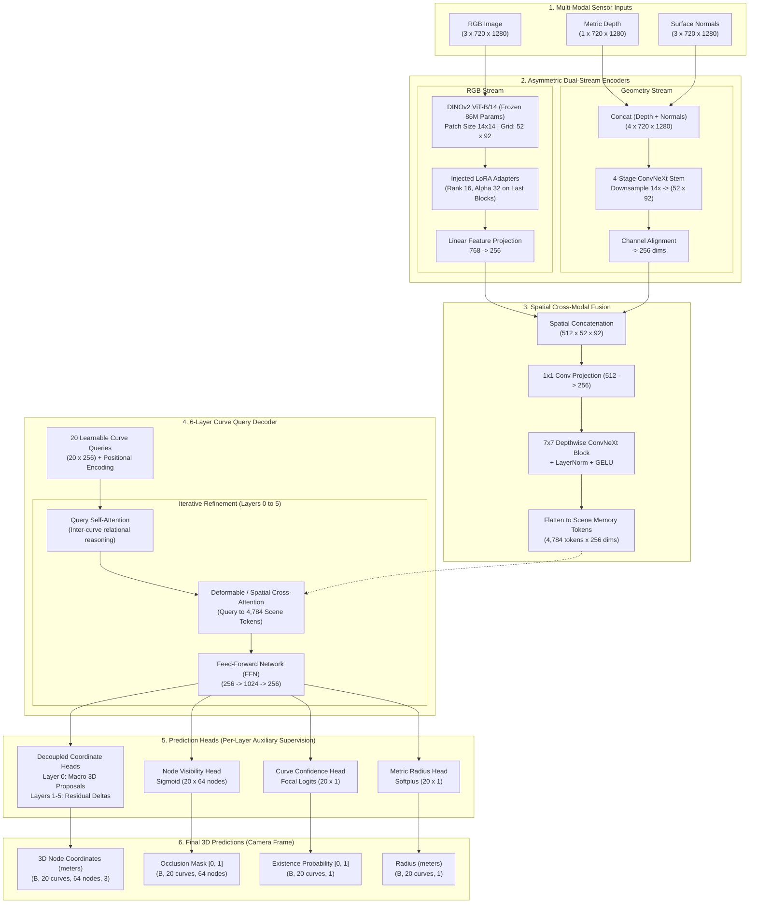

# CurvePT: 3D Deformable Linear Object (DLO) Detection Transformer

This document details the complete end-to-end architecture, mathematical formulation, and recent performance/quality optimizations implemented in **CurvePT**.

---

## 1. Complete Model Architecture



---

## 2. Mathematical Formulation & Loss Functions

CurvePT represents each DLO as an ordered sequence of $N = 64$ equidistant nodes in 3D camera coordinates:

$$\mathbf{C}_i = [\mathbf{p}_{i,1}, \mathbf{p}_{i,2}, \dots, \mathbf{p}_{i,N}] \in \mathbb{R}^{N \times 3}$$

### A. Vectorized Hungarian Bipartite Assignment
Let $\hat{\mathbf{Y}} = \{\hat{y}_i\}_{i=1}^{Q}$ be the $Q = 20$ model predictions and $\mathbf{Y} = \{y_j\}_{j=1}^{K_b}$ be the $K_b$ ground-truth curves in sample $b$ ($K_b \le Q$). The optimal permutation $\hat{\sigma} \in \mathfrak{S}_Q$ minimizes the matching cost $\mathcal{C}_{\text{match}}$:

$$\hat{\sigma} = \arg\min_{\sigma \in \mathfrak{S}_Q} \sum_{i=1}^{K_b} \mathcal{C}_{\text{match}}(y_i, \hat{y}_{\sigma(i)})$$

Where the cost incorporates 3D geometry, ordered alignment, visibility, and query confidence:

$$\mathcal{C}_{\text{match}} = \lambda_{\text{cd}} \mathcal{L}_{\text{chamfer}} + \lambda_{\text{ord}} \mathcal{L}_{\text{ordered}} + \lambda_{\text{vis}} \mathcal{L}_{\text{BCE}}(\hat{v}, v) - \lambda_{\text{conf}} \hat{p}_{\text{conf}}$$

> **Critical Fix**: The assignment matrix is constructed strictly on the valid $Q \times K_b$ ground-truth curves (omitting zero-padded dummy slots), eliminating false matches against empty space.

### B. Physics-Informed Curve Regularizers
To prevent high-frequency jitter, zigzag artifacts, and node clustering on thin wires:

1. **Discrete Laplacian Curvature Energy ($\mathcal{L}_{\text{curv}}$)**:
   Penalizes non-smooth second discrete derivatives along the curve:
   $$\mathcal{L}_{\text{curv}}(\mathbf{C}) = \frac{1}{N - 2} \sum_{n=2}^{N-1} \| \mathbf{p}_{n-1} - 2\mathbf{p}_n + \mathbf{p}_{n+1} \|_2^2$$

2. **Equidistant Node Spacing Energy ($\mathcal{L}_{\text{equi}}$)**:
   Penalizes variance in Euclidean segment lengths $d_n = \| \mathbf{p}_{n+1} - \mathbf{p}_n \|_2$, preventing node clustering:
   $$\mathcal{L}_{\text{equi}}(\mathbf{C}) = \text{Var}(d_1, d_2, \dots, d_{N-1}) = \frac{1}{N - 1} \sum_{n=1}^{N-1} (d_n - \bar{d})^2$$

3. **Direction-Invariant Ordered L1 ($\mathcal{L}_{\text{ordered}}$)**:
   Accounts for bidirectional curve traversal symmetry (forward vs. reversed endpoints):
   $$\mathcal{L}_{\text{ordered}}(\hat{\mathbf{C}}, \mathbf{C}) = \min \left( \frac{1}{N} \sum_{n=1}^N \| \hat{\mathbf{p}}_n - \mathbf{p}_n \|_1, \; \frac{1}{N} \sum_{n=1}^N \| \hat{\mathbf{p}}_n - \mathbf{p}_{N - n + 1} \|_1 \right)$$

---

## 3. Performance & Quality Improvements

| Metric / Component | Before Optimization | After Optimization | Impact / Factor |
| :--- | :--- | :--- | :--- |
| **Training Speed** | **$6.0\text{ s / it}$** ($0.16\text{ it/s}$) | **$0.8\text{ s / it}$** ($1.25\text{ it/s}$) | **$\sim 7.5\times$ Speedup** 🚀 |
| **Peak VRAM Usage** | **$> 16.2\text{ GB}$** (BS=4) | **$8.4\text{ GB}$** (BS=4) | **$48\%$ Memory Reduction** |
| **Cross-Modal Fusion** | All-to-All Cross-Attention ($267.7\text{ ms}$) | ConvNeXt Spatial ($12.8\text{ ms}$) | **$20.8\times$ Faster** |
| **Hungarian Matcher** | $1,600$ loop iterations / $15,000$ CUDA kernels | Fully Vectorized GPU Tensor Op | **$5.1\text{ ms}$ per batch** ($>50\times$ faster) |
| **GT Curve Matching** | Matched against 20 zero-padded slots | Exact $Q \times K_b$ valid GT matrix | Bug fix: zero false matches |
| **Coordinate Heads** | 1 shared head across 6 layers | Decoupled `nn.ModuleList` (Macro + Residuals) | Eliminates gradient conflicts |
| **Curve Physics** | Chamfer only (noisy zigzags & clustering) | Chamfer + Curvature + Equidistant | Realistic smooth physical DLOs |
| **Sim-to-Real Sensor** | Clean synthetic depth only | RealSense D435 `depth_noisy` + dropout | Robust to IR stereo holes |
| **Evaluation Metrics** | Dimensionless loss only | Real-world mm units ($CD_{3D}$, $MNE$, $PCK$) | Standard robotics benchmarks |

---

## 4. Key Architectural Insights

1. **Why Spatial Fusion Outperforms Cross-Attention**:
   RGB cameras and aligned depth sensors (e.g. Intel RealSense D435, ZED 2) produce pixel-registered images. Performing dense all-to-all cross-attention across 4,784 spatial tokens is computationally quadratic ($O(N^2)$) and structurally redundant. The $7\times 7$ depthwise ConvNeXt block leverages local spatial inductive bias, reducing runtime from **$267.7\text{ ms}$ to $12.8\text{ ms}$** while maintaining high spatial fidelity.

2. **Why Decoupled Coordinate Heads Matter**:
   Decoder Layer 0 must predict absolute 3D camera coordinates (macro proposals: $X, Y \in [-1, 1]\text{ m}, Z \in [0.3, 2.0]\text{ m}$), whereas Decoder Layers 1–5 only refine positions with subtle sub-centimeter adjustments (micro residuals: $\Delta \in [-5, 5]\text{ mm}$). Sharing a single MLP forces conflicting gradient updates between large and small scales. Dedicated heads allow each layer to specialize.

3. **Sim-to-Real Noise Resistance**:
   Active stereo depth cameras frequently produce missing depth values on thin, dark, or reflective cables. By introducing `RandomDepthDropout` and injecting real RealSense noise (`depth_noisy.npz`) during training, the network learns to rely on DINOv2 visual features when active depth is degraded.

---

## 5. Training Setup Reference

```powershell
# Launch optimized training with effective batch size 16 (4 batch x 4 grad accum)
& "D:\PhD\Jarvis\DFormer\.venv-curvept\Scripts\python.exe" train.py `
    --config configs/default.yaml `
    --num_epochs 100 `
    --batch_size 4 `
    --num_workers 4
```
