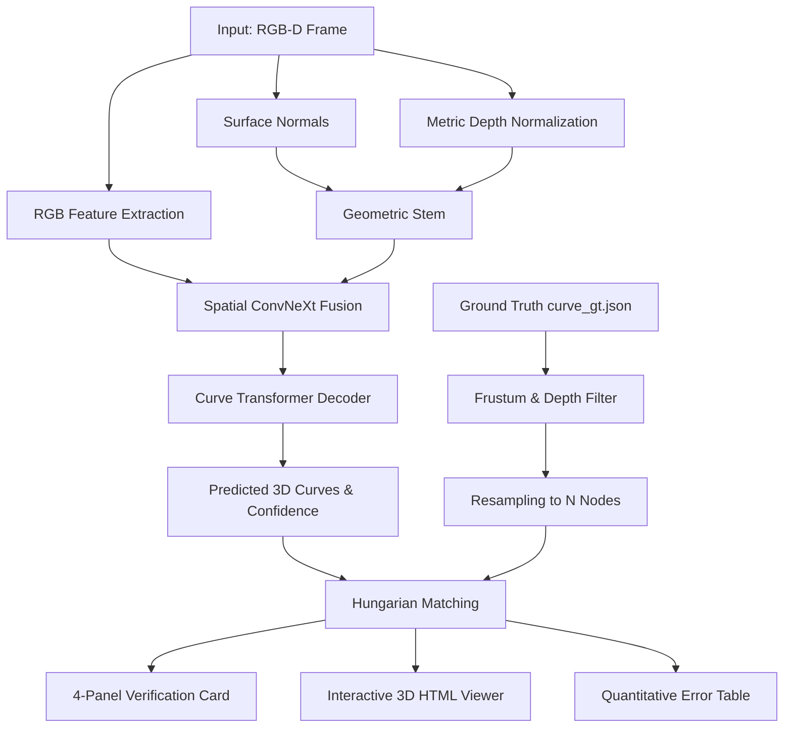

# CurvePT Inference, Evaluation, and Visualization Guide

This document provides a comprehensive guide on how to use [`visualize_eval.py`](visualize_eval.py), how its underlying pipeline works, and how to interpret the generated multi-panel visual cards and interactive 3D WebGL viewers.

---

## 1. Overview & Pipeline Architecture

The CurvePT evaluation suite bridges deep neural predictions with real-world physical verification. Rather than merely outputting summary numbers, it produces publication-ready multi-panel visual cards and interactive 3D WebGL models for comprehensive spatial inspection.



### Core Components of the Pipeline:

1. **Sensor Ingestion & Surface Normal Generation**:
   - **RGB**: Normalized to $[0, 1]$ floating-point tensor of shape $(3, H, W)$.
   - **Metric Depth**: Scaled in meters. When depth maps are loaded from dataset `.npz` files, they are clipped to `max_depth` (default: 3.0m).
   - **Surface Normals**: If a precomputed `normals.npz` exists, it is loaded directly. If running on raw or live RGB-D streams, surface normals are computed **on-the-fly** via the cross product of 3D spatial gradients:
     $$\mathbf{P}(u, v) = \left( \frac{u - c_x}{f_x} z, \; \frac{v - c_y}{f_y} z, \; z \right)$$
     $$\mathbf{n}(u, v) = \frac{\nabla_x \mathbf{P} \times \nabla_y \mathbf{P}}{\|\nabla_x \mathbf{P} \times \nabla_y \mathbf{P}\|_2}$$

2. **Ground Truth Projection & Frustum Filtering**:
   - Global 3D points $\mathbf{p}_w$ from `curve_gt.json` are transformed into the camera coordinate system:
     $$\mathbf{p}_c = [R \mid T] \begin{bmatrix} \mathbf{p}_w \\ 1 \end{bmatrix}$$
   - Points are projected onto the image plane via intrinsics matrix $K$:
     $$u = f_x \frac{x_c}{z_c} + c_x, \quad v = f_y \frac{y_c}{z_c} + c_y$$
   - Curves are resampled to exactly `num_nodes` (64 points) evenly spaced by arc length.
   - Curves outside the camera frustum ($0 \le u < W$, $0 \le v < H$, $0.05\text{m} < z \le 3.0\text{m}$) are automatically filtered out.

3. **Direction-Invariant Hungarian Matching**:
   - Bipartite matching solves optimal 1-to-1 assignment between $Q$ predicted curve queries and $K$ ground truth curves.
   - Handles direction ambiguity: deformable linear objects can be traversed from head-to-tail ($A \to B$) or tail-to-head ($B \to A$). The matcher tests both orientations and selects the minimum cost traversal.

---

## 2. The 4-Panel Verification Card

Each evaluated frame generates a high-resolution 150 DPI figure composed of four complementary views:

| Panel | Description | What to Look For |
| :--- | :--- | :--- |
| **Top-Left (RGB View)** | Full RGB image overlaid with Ground Truth (dashed lime-green) and Predicted DLOs (solid vibrant colors with endpoint dots and confidence badge). | Check whether detected curves follow the visual cable path, whether endpoints are accurately placed, and if occlusions cause query drops. |
| **Top-Right (Depth View)** | Depth map in `inferno` colormap with overlaid curve projections. | Verifies if the 2D curve alignment coincides with the physical depth edges and depth discontinuities of the scene. |
| **Bottom-Left (3D Isometric View)** | True 3D spatial curve routing in physical camera coordinates ($X$ right, $Z$ depth, $-Y$ up in meters). | Reveals 3D errors invisible in 2D views: spatial sag, depth errors, out-of-plane bowing, and true physical Euclidean alignment. |
| **Bottom-Right (Error Profile)** | Line graph showing Euclidean Error (in millimeters) for every node from Head ($0$) to Tail ($63$), alongside reference lines (10mm, 20mm, 50mm) and a summary metrics box. | Pinpoints where the model is most accurate (e.g. rigid straight segments) vs where error spikes (e.g. near sharp bends or occluded endpoints). |

---

## 3. Interactive 3D WebGL HTML Viewer

When `--export_html` is passed, a standalone HTML file is generated alongside each image.
- Built using **Three.js WebGL** with zero external dependencies (loads standard Three.js from CDN).
- **Navigation Controls**:
  - **Left-Click + Drag**: Orbit and rotate the 3D cables freely in space.
  - **Right-Click + Drag**: Pan the camera.
  - **Scroll Wheel**: Zoom in / out.
- **Color Coding**:
  - 🟢 **Ground Truth 3D Curves**: Rendered in vibrant green with node sphere markers.
  - 🔵 🟠 🟣 **Predicted 3D Curves**: Rendered in distinct solid colors with node markers.

---

## 4. How to Use

### A. Evaluate Multiple Scenes from Validation Split (Recommended)
Runs inference over $N$ diverse scenes from `configs/splits/val.json`, generates 4-panel visual cards, interactive 3D HTMLs, and prints an aggregate summary table:

```powershell
D:\PhD\Jarvis\DFormer\.venv-curvept\Scripts\python.exe visualize_eval.py `
    --checkpoint checkpoints/best.pt `
    --num_samples 10 `
    --output_dir visualizations `
    --export_html
```

#### Expected Terminal Output:
```
===========================================================================
  CurvePT Verification & Visual Inference: 10 samples
===========================================================================
  [SAVED FIGURE] visualizations\scene_1029_frame_0004.png
  [SAVED 3D HTML] visualizations\scene_1029_frame_0004_3d.html
  [01/10] scene_1029_frame_0004     | GT: 1 | Pred: 1 | MNE: 89.1 mm
  [02/10] scene_1030_frame_0003     | GT: 2 | Pred: 2 | MNE: 64.2 mm
  ...
===========================================================================
  OVERALL EVALUATION SUMMARY across 14 evaluated curves:
  • Mean Node Error (MNE):   72.4 mm
  • Median MNE:              68.1 mm
  • Best Single Curve MNE:   18.5 mm
  • Visual Cards Saved To:   visualizations
===========================================================================
```

---

### B. Evaluate a Specific Scene / Frame Directory
Inspect a particular failure case or difficult scene:

```powershell
D:\PhD\Jarvis\DFormer\.venv-curvept\Scripts\python.exe visualize_eval.py `
    --checkpoint checkpoints/best.pt `
    --frame_dir "F:/Jarvis/1k_Curve_Dataset/Curve_Data_Compact_RealSenseD435_v3/scene_1029/frame_0004" `
    --output_dir visualizations `
    --export_html
```

---

### C. Unsupervised Real-World Mode (No Ground Truth)
Run CurvePT on any custom RGB-D frame or live sensor recording without ground truth annotations:

```powershell
D:\PhD\Jarvis\DFormer\.venv-curvept\Scripts\python.exe visualize_eval.py `
    --checkpoint checkpoints/best.pt `
    --rgb "path/to/my_image.png" `
    --depth "path/to/my_depth.npz" `
    --output_dir visualizations
```

---

## 5. Command-Line Arguments Reference

| Argument | Type | Default | Description |
| :--- | :--- | :--- | :--- |
| `--checkpoint` | `str` | `checkpoints/best.pt` | Path to trained model weights (`.pt`). |
| `--config` | `str` | `configs/default.yaml` | Path to model/data configuration YAML. |
| `--frame_dir` | `str` | `None` | Path to a single frame directory containing `rgb_left.png`, `depth_clean.npz`, etc. |
| `--split` | `str` | `configs/splits/val.json` | Path to validation split JSON file. |
| `--num_samples` | `int` | `8` | Number of validation scenes to evaluate and render. |
| `--threshold` | `float` | `0.25` | Confidence cutoff threshold for DLO query detection. |
| `--output_dir` | `str` | `visualizations` | Target directory where PNGs and HTMLs are saved. |
| `--export_html` | `flag` | `False` | When set, writes an interactive 3D WebGL HTML viewer for each sample. |

---

## 6. How to Interpret Evaluation Metrics

- **Mean Node Error (MNE)**:
  The true linear Euclidean distance in 3D physical space:
  $$\text{MNE} = \frac{1}{N} \sum_{i=0}^{N-1} \|\mathbf{p}_i - \mathbf{g}_i\|_2 \quad (\text{in mm})$$
  - **$< 30\text{ mm}$ ($< 3\text{ cm}$)**: Precision suitable for robotic grasping and insertion tasks.
  - **$30\text{–}70\text{ mm}$ ($3\text{–}7\text{ cm}$)**: Good macro-routing accuracy; suitable for obstacle avoidance and topological tracking.
  - **$> 100\text{ mm}$ ($> 10\text{ cm}$)**: Coarse detection; likely has slight endpoint drift or depth offset.

- **Percentage of Correct Keypoints (PCK)**:
  Measures the percentage of curve nodes whose 3D error falls under a fixed millimeter radius:
  - **`PCK@10mm`**: Strict precision threshold ($1.0\text{ cm}$).
  - **`PCK@20mm`**: Moderate precision threshold ($2.0\text{ cm}$).
  - **`PCK@50mm`**: Coarse topological threshold ($5.0\text{ cm}$).

